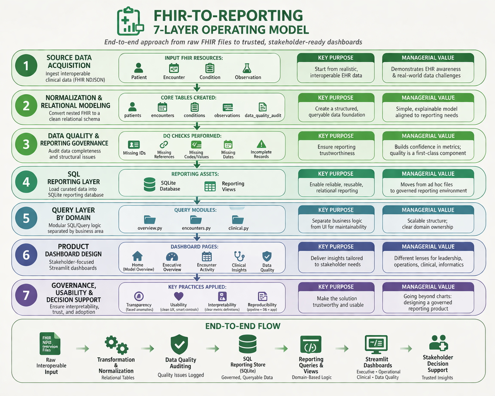

# 🏥 Healthcare Reporting Dashboard  
**FHIR → SQL → Streamlit | End-to-End Health Informatics Reporting System**

---

## 📌 Overview

This project demonstrates an **end-to-end healthcare reporting system** that transforms raw interoperable clinical data (FHIR) into **trusted, stakeholder-ready dashboards**.

It is designed to reflect **real-world health informatics workflows**, combining:

- EHR-style data ingestion (FHIR NDJSON)
- Relational data modeling
- Data quality auditing
- SQL-based reporting layer
- Stakeholder-focused dashboards

---

## 🧠 The Operating Model

The entire solution is built on a **7-layer operating model** that ensures data flows from raw ingestion to decision support in a governed and explainable way.



### Key Philosophy:
> Reporting quality = Data quality + Governance + Usability

---

## 🏗️ Architecture

FHIR NDJSON → Transformation → Relational Tables → Data Quality Audit  
→ SQLite Reporting Layer → SQL Views → Query Modules → Streamlit Dashboard

---

## 📂 Project Structure
```text
healthcare-reporting-dashboard/
│
├── Home.py
├── pages/
│   ├── 1_Executive_Overview.py
│   ├── 2_Encounter_Activity.py
│   ├── 3_Clinical_Insights.py
│   └── 4_Data_Quality.py
│
├── src/
│   ├── transform/
│   ├── database/
│   ├── queries/
│   └── app/
│
├── data/
│   ├── raw/                # FHIR NDJSON (not committed)
│   └── processed/          # Cleaned CSV outputs
│
├── assets/
│   └── homepage-image/
│
├── requirements.txt
└── README.md
```
---

## ⚙️ Data Pipeline

### 1. Data Source (FHIR)
- Synthetic healthcare data generated via **Synthea**
- Resources:
  - Patient
  - Encounter
  - Condition
  - Observation

---

### 2. Transformation Layer
- Flattened nested FHIR JSON into tabular format
- Extracted:
  - Patient demographics
  - Encounter timelines & classes
  - Clinical conditions
  - Observations (vitals, BMI, pain score, etc.)

---

### 3. Relational Modeling
Created structured tables:
- `patients`
- `encounters`
- `conditions`
- `observations`
- `data_quality_audit`

---

### 4. Data Quality Framework

Built-in auditing for:
- Missing IDs
- Missing foreign key references
- Missing values (e.g., BMI, pain score)
- Unrealistic values (e.g., extreme encounter durations)

---

### 5. SQL Reporting Layer

- SQLite database for analytics
- Views created for:
  - Overview metrics
  - Encounter trends
  - Clinical summaries
  - Data quality insights

---

### 6. Query Layer (Modular Design)

Separated business logic from UI:

- `overview.py`
- `encounters.py`
- `clinical.py`
- `data_quality.py`

---

### 7. Dashboard (Streamlit)

Multi-page application:

#### 🏠 Home
- Operating model overview
- System design narrative

#### 📊 Executive Overview
- KPI flashcards
- Patient utilization metrics (dynamic slider)
- Encounter class distribution (donut chart)
- Data quality summaries

#### 🏥 Encounter Activity
- Encounter trends by year/month
- Encounter class breakdown
- Duration distribution (with percentile trimming)

#### 🧬 Clinical Insights
- Average BMI, Weight, Height, Pain Score
- Boxplots for clinical variability
- Scatter plots for clinical relationships

#### ⚠️ Data Quality
- Data quality issue tracking
- Conditional visualization logic
- Observation completeness analysis

---

## 📊 Key Features

- ✅ FHIR → relational transformation
- ✅ Built-in data quality auditing
- ✅ SQL-driven reporting layer
- ✅ Modular query architecture
- ✅ Interactive filtering (year-based)
- ✅ KPI flashcards with business context
- ✅ Percentile-based outlier handling
- ✅ Stakeholder-oriented dashboard design

---

## 🚀 How to Run

### 1. Clone repo
```bash
git clone https://github.com/toluwaniosabiya/healthcare-reporting-dashboard.git
cd healthcare-reporting-dashboard
```

### 2. Create environment
```bash
python -m venv venv
source venv/bin/activate   # Mac/Linux
venv\Scripts\activate      # Windows
```

### 3. Install dependencies
```bash
pip install -r requirements.txt
```

### 4. Run app
```bash
streamlit run Home.py
```

---

## 📌 Notes on Data

- Raw FHIR data is **not included in the repository**
- To reproduce:
  - Generate data via **Synthea**
  - Place NDJSON files in `data/raw/`
  - Run transformation pipeline

---

## 🎯 Why This Project Matters

This project demonstrates:

### 🔹 Health Informatics Understanding
- FHIR structure
- Clinical data modeling
- EHR-style datasets

### 🔹 Reporting & Analytics Engineering
- SQL-based reporting design
- Modular query architecture
- Data quality as a reporting dimension

### 🔹 Product Thinking
- Stakeholder-focused dashboards
- Usability and interpretability
- Clear metric definitions

### 🔹 Managerial Perspective
- Governance-first approach
- Explainable reporting pipelines
- Alignment with real-world healthcare systems

---

## 🔮 Future Improvements

- Integration with real EHR datasets
- FHIR API ingestion (instead of static files)
- Role-based dashboards
- Automated data quality alerts
- Cloud deployment with Snowflake / BigQuery

---

## 👤 Author

**Toluwani Osabiya**  
Data Scientist | Health Informatics Enthusiast  

---

## ⭐ If you found this useful

Give it a star ⭐ — and feel free to connect!
